# DuPharma System - Diagrams and Flow Documentation

## Table of Contents
1. [User Flow Diagrams](#user-flow-diagrams)
2. [Data Flow Diagrams](#data-flow-diagrams)
3. [Sequence Diagrams](#sequence-diagrams)
4. [System Architecture](#system-architecture)

---

## User Flow Diagrams

### 1. Customer Shop Flow

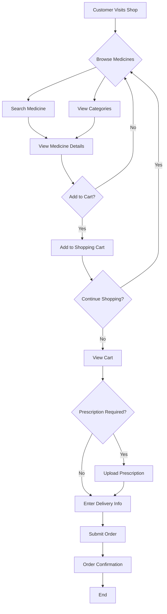
```mermaid
flowchart TD
    A[Customer Visits Shop] --> B{Browse Medicines}
    B --> C[Search Medicine]
    B --> D[View Categories]
    C --> E[View Medicine Details]
    D --> E
    E --> F{Add to Cart?}
    F -->|Yes| G[Add to Shopping Cart]
    F -->|No| B
    G --> H{Continue Shopping?}
    H -->|Yes| B
    H -->|No| I[View Cart]
    I --> J{Prescription Required?}
    J -->|Yes| K[Upload Prescription]
    J -->|No| L[Enter Delivery Info]
    K --> L
    L --> M[Submit Order]
    M --> N[Order Confirmation]
    N --> O[End]
```

### 2. Staff Login and Dashboard Flow

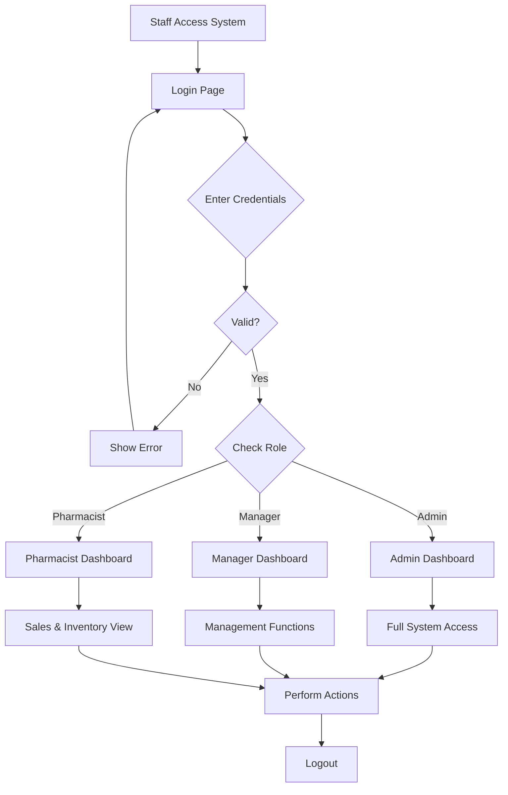
```mermaid
flowchart TD
    A[Staff Access System] --> B[Login Page]
    B --> C{Enter Credentials}
    C --> D{Valid?}
    D -->|No| E[Show Error]
    E --> B
    D -->|Yes| F{Check Role}
    F -->|Admin| G[Admin Dashboard]
    F -->|Manager| H[Manager Dashboard]
    F -->|Pharmacist| I[Pharmacist Dashboard]
    G --> J[Full System Access]
    H --> K[Management Functions]
    I --> L[Sales & Inventory View]
    J --> M[Perform Actions]
    K --> M
    L --> M
    M --> N[Logout]
```

### 3. Sales/POS Transaction Flow

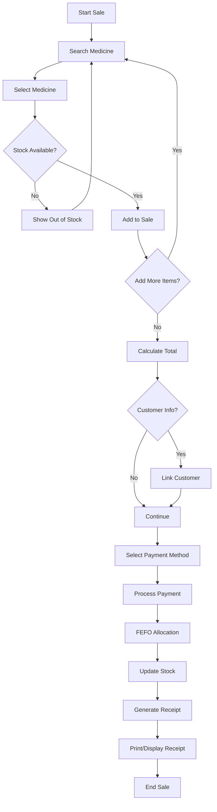
```mermaid
flowchart TD
    A[Start Sale] --> B[Search Medicine]
    B --> C[Select Medicine]
    C --> D{Stock Available?}
    D -->|No| E[Show Out of Stock]
    E --> B
    D -->|Yes| F[Add to Sale]
    F --> G{Add More Items?}
    G -->|Yes| B
    G -->|No| H[Calculate Total]
    H --> I{Customer Info?}
    I -->|Yes| J[Link Customer]
    I -->|No| K[Continue]
    J --> K
    K --> L[Select Payment Method]
    L --> M[Process Payment]
    M --> N[FEFO Allocation]
    N --> O[Update Stock]
    O --> P[Generate Receipt]
    P --> Q[Print/Display Receipt]
    Q --> R[End Sale]
```

### 4. Medicine Management Flow

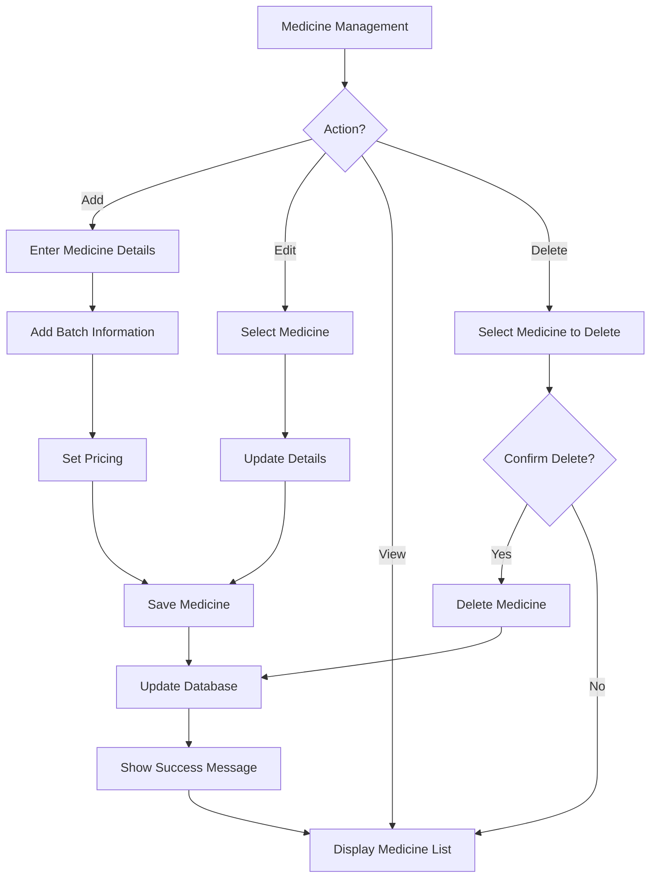
```mermaid
flowchart TD
    A[Medicine Management] --> B{Action?}
    B -->|Add| C[Enter Medicine Details]
    B -->|Edit| D[Select Medicine]
    B -->|View| E[Display Medicine List]
    B -->|Delete| F[Select Medicine to Delete]
    C --> G[Add Batch Information]
    G --> H[Set Pricing]
    H --> I[Save Medicine]
    D --> J[Update Details]
    J --> I
    F --> K{Confirm Delete?}
    K -->|Yes| L[Delete Medicine]
    K -->|No| E
    I --> M[Update Database]
    L --> M
    M --> N[Show Success Message]
    N --> E
```

### 5. Order Management Flow (Staff)

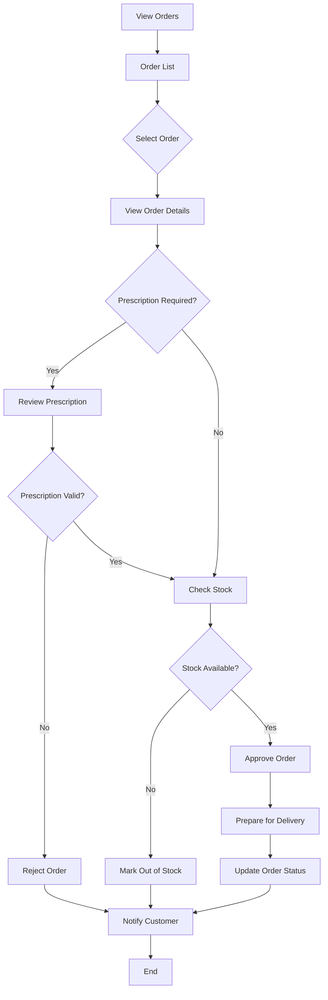
```mermaid
flowchart TD
    A[View Orders] --> B[Order List]
    B --> C{Select Order}
    C --> D[View Order Details]
    D --> E{Prescription Required?}
    E -->|Yes| F[Review Prescription]
    E -->|No| G[Check Stock]
    F --> H{Prescription Valid?}
    H -->|No| I[Reject Order]
    H -->|Yes| G
    G --> J{Stock Available?}
    J -->|No| K[Mark Out of Stock]
    J -->|Yes| L[Approve Order]
    I --> M[Notify Customer]
    K --> M
    L --> N[Prepare for Delivery]
    N --> O[Update Order Status]
    O --> M
    M --> P[End]
```

---

## Data Flow Diagrams

### Level 0: Context Diagram

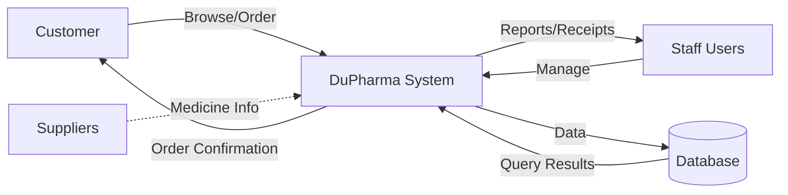
```mermaid
flowchart LR
    Customer[Customer] -->|Browse/Order| System[DuPharma System]
    Staff[Staff Users] -->|Manage| System
    System -->|Order Confirmation| Customer
    System -->|Reports/Receipts| Staff
    System -->|Data| Database[(Database)]
    Database -->|Query Results| System
    Supplier[Suppliers] -.->|Medicine Info| System
```

### Level 1: Main System Processes

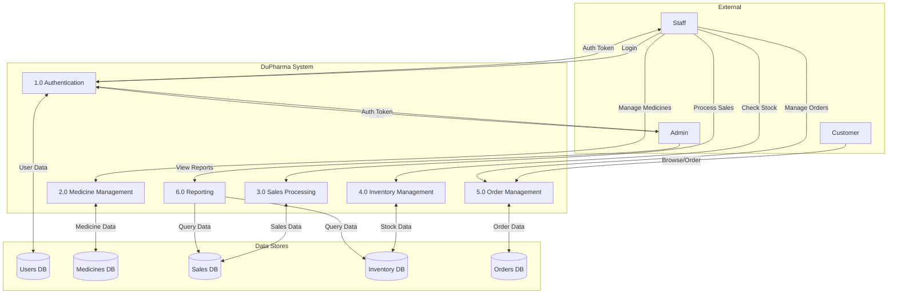
```mermaid
flowchart TD
    subgraph External
        A[Customer]
        B[Staff]
        C[Admin]
    end
    
    subgraph "DuPharma System"
        D[1.0 Authentication]
        E[2.0 Medicine Management]
        F[3.0 Sales Processing]
        G[4.0 Inventory Management]
        H[5.0 Order Management]
        I[6.0 Reporting]
    end
    
    subgraph Data Stores
        J[(Users DB)]
        K[(Medicines DB)]
        L[(Sales DB)]
        M[(Inventory DB)]
        N[(Orders DB)]
    end
    
    A -->|Browse/Order| H
    B -->|Login| D
    C -->|Login| D
    D -->|Auth Token| B
    D -->|Auth Token| C
    B -->|Manage Medicines| E
    B -->|Process Sales| F
    B -->|Check Stock| G
    B -->|Manage Orders| H
    C -->|View Reports| I
    
    D <-->|User Data| J
    E <-->|Medicine Data| K
    F <-->|Sales Data| L
    G <-->|Stock Data| M
    H <-->|Order Data| N
    I -->|Query Data| L
    I -->|Query Data| M
```

### Level 2: Sales Processing Detail

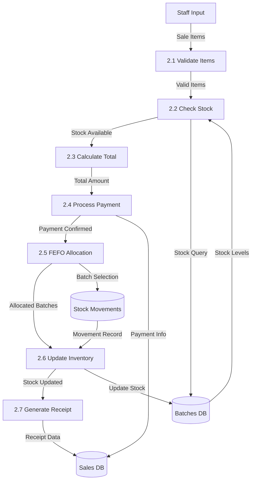
```mermaid
flowchart TD
    A[Staff Input] -->|Sale Items| B[2.1 Validate Items]
    B -->|Valid Items| C[2.2 Check Stock]
    C -->|Stock Available| D[2.3 Calculate Total]
    D -->|Total Amount| E[2.4 Process Payment]
    E -->|Payment Confirmed| F[2.5 FEFO Allocation]
    F -->|Allocated Batches| G[2.6 Update Inventory]
    G -->|Stock Updated| H[2.7 Generate Receipt]
    
    C -->|Stock Query| I[(Batches DB)]
    I -->|Stock Levels| C
    G -->|Update Stock| I
    E -->|Payment Info| J[(Sales DB)]
    H -->|Receipt Data| J
    F -->|Batch Selection| K[(Stock Movements)]
    K -->|Movement Record| G
```

---

## Sequence Diagrams

### 1. Customer Order Placement

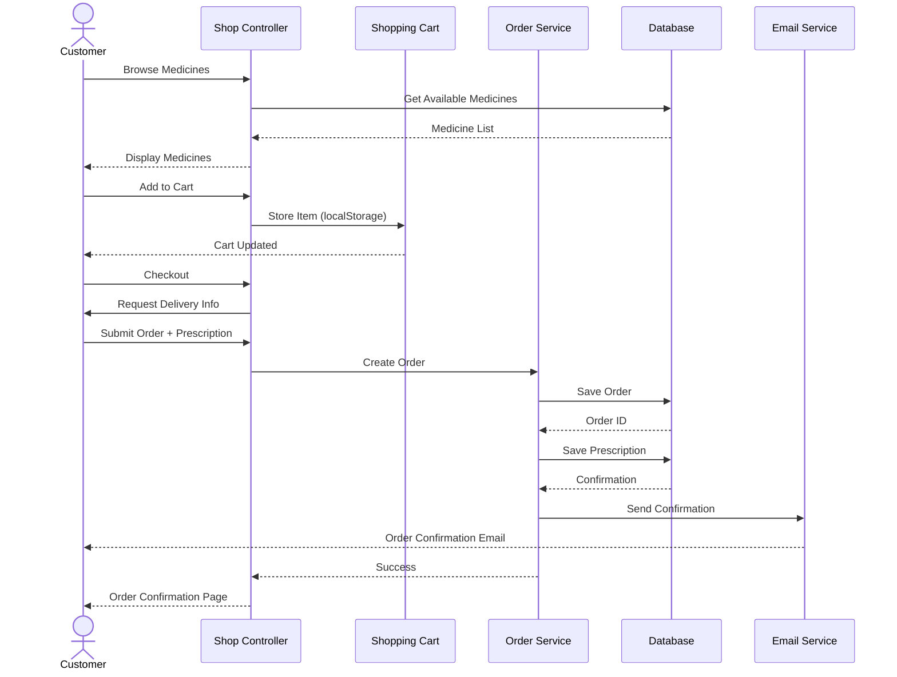
```mermaid
sequenceDiagram
    actor Customer
    participant Shop as Shop Controller
    participant Cart as Shopping Cart
    participant Order as Order Service
    participant DB as Database
    participant Email as Email Service
    
    Customer->>Shop: Browse Medicines
    Shop->>DB: Get Available Medicines
    DB-->>Shop: Medicine List
    Shop-->>Customer: Display Medicines
    
    Customer->>Shop: Add to Cart
    Shop->>Cart: Store Item (localStorage)
    Cart-->>Customer: Cart Updated
    
    Customer->>Shop: Checkout
    Shop->>Customer: Request Delivery Info
    Customer->>Shop: Submit Order + Prescription
    
    Shop->>Order: Create Order
    Order->>DB: Save Order
    DB-->>Order: Order ID
    
    Order->>DB: Save Prescription
    DB-->>Order: Confirmation
    
    Order->>Email: Send Confirmation
    Email-->>Customer: Order Confirmation Email
    
    Order-->>Shop: Success
    Shop-->>Customer: Order Confirmation Page
```

### 2. Staff Sales Transaction (POS)

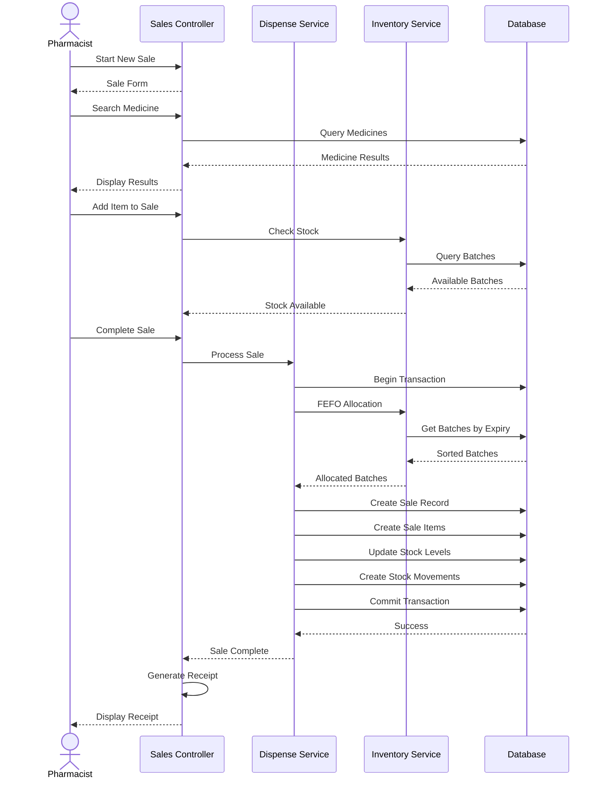
```mermaid
sequenceDiagram
    actor Pharmacist
    participant POS as Sales Controller
    participant Dispense as Dispense Service
    participant Inventory as Inventory Service
    participant DB as Database
    
    Pharmacist->>POS: Start New Sale
    POS-->>Pharmacist: Sale Form
    
    Pharmacist->>POS: Search Medicine
    POS->>DB: Query Medicines
    DB-->>POS: Medicine Results
    POS-->>Pharmacist: Display Results
    
    Pharmacist->>POS: Add Item to Sale
    POS->>Inventory: Check Stock
    Inventory->>DB: Query Batches
    DB-->>Inventory: Available Batches
    Inventory-->>POS: Stock Available
    
    Pharmacist->>POS: Complete Sale
    POS->>Dispense: Process Sale
    
    Dispense->>DB: Begin Transaction
    Dispense->>Inventory: FEFO Allocation
    Inventory->>DB: Get Batches by Expiry
    DB-->>Inventory: Sorted Batches
    Inventory-->>Dispense: Allocated Batches
    
    Dispense->>DB: Create Sale Record
    Dispense->>DB: Create Sale Items
    Dispense->>DB: Update Stock Levels
    Dispense->>DB: Create Stock Movements
    Dispense->>DB: Commit Transaction
    
    DB-->>Dispense: Success
    Dispense-->>POS: Sale Complete
    POS->>POS: Generate Receipt
    POS-->>Pharmacist: Display Receipt
```

### 3. User Authentication

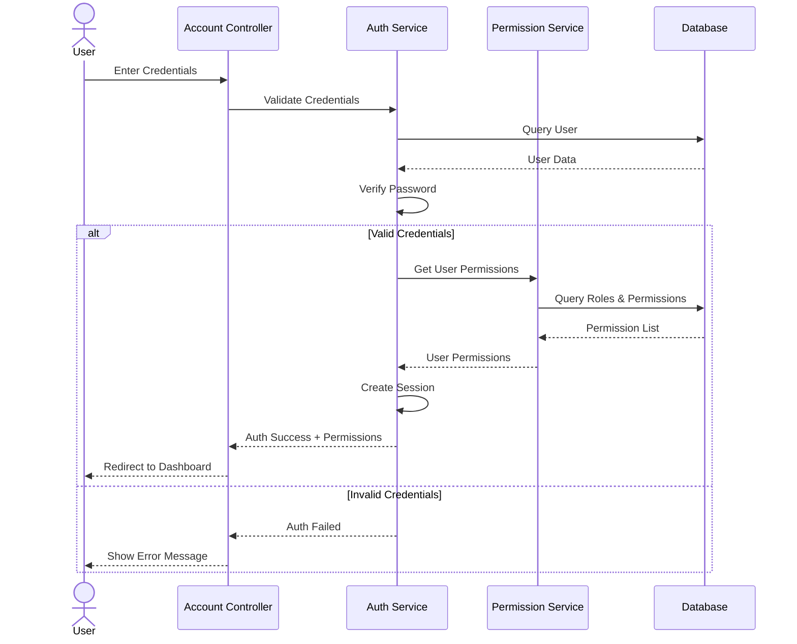
```mermaid
sequenceDiagram
    actor User
    participant Login as Account Controller
    participant Auth as Auth Service
    participant Permission as Permission Service
    participant DB as Database
    
    User->>Login: Enter Credentials
    Login->>Auth: Validate Credentials
    Auth->>DB: Query User
    DB-->>Auth: User Data
    
    Auth->>Auth: Verify Password
    
    alt Valid Credentials
        Auth->>Permission: Get User Permissions
        Permission->>DB: Query Roles & Permissions
        DB-->>Permission: Permission List
        Permission-->>Auth: User Permissions
        
        Auth->>Auth: Create Session
        Auth-->>Login: Auth Success + Permissions
        Login-->>User: Redirect to Dashboard
    else Invalid Credentials
        Auth-->>Login: Auth Failed
        Login-->>User: Show Error Message
    end
```

### 4. Medicine Batch Management

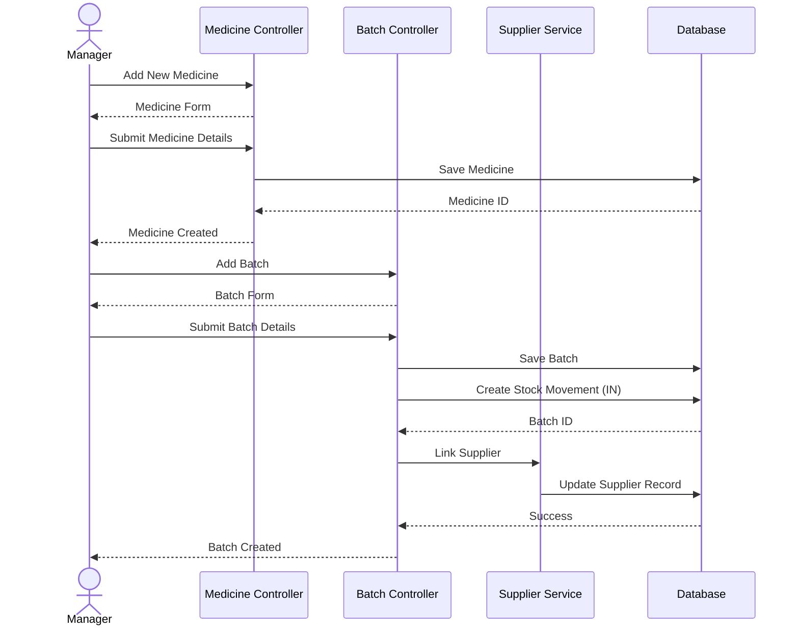
```mermaid
sequenceDiagram
    actor Manager
    participant Medicine as Medicine Controller
    participant Batch as Batch Controller
    participant Supplier as Supplier Service
    participant DB as Database
    
    Manager->>Medicine: Add New Medicine
    Medicine-->>Manager: Medicine Form
    
    Manager->>Medicine: Submit Medicine Details
    Medicine->>DB: Save Medicine
    DB-->>Medicine: Medicine ID
    
    Medicine-->>Manager: Medicine Created
    
    Manager->>Batch: Add Batch
    Batch-->>Manager: Batch Form
    
    Manager->>Batch: Submit Batch Details
    Batch->>DB: Save Batch
    Batch->>DB: Create Stock Movement (IN)
    DB-->>Batch: Batch ID
    
    Batch->>Supplier: Link Supplier
    Supplier->>DB: Update Supplier Record
    
    DB-->>Batch: Success
    Batch-->>Manager: Batch Created
```

### 5. Order Approval Process

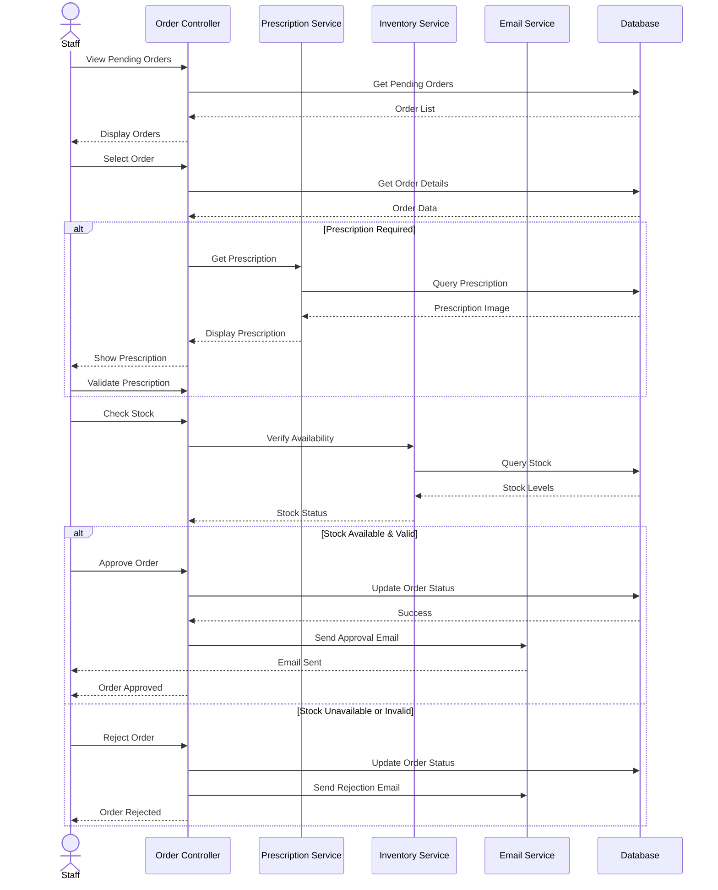
```mermaid
sequenceDiagram
    actor Staff
    participant Order as Order Controller
    participant Prescription as Prescription Service
    participant Inventory as Inventory Service
    participant Email as Email Service
    participant DB as Database
    
    Staff->>Order: View Pending Orders
    Order->>DB: Get Pending Orders
    DB-->>Order: Order List
    Order-->>Staff: Display Orders
    
    Staff->>Order: Select Order
    Order->>DB: Get Order Details
    DB-->>Order: Order Data
    
    alt Prescription Required
        Order->>Prescription: Get Prescription
        Prescription->>DB: Query Prescription
        DB-->>Prescription: Prescription Image
        Prescription-->>Order: Display Prescription
        Order-->>Staff: Show Prescription
        
        Staff->>Order: Validate Prescription
    end
    
    Staff->>Order: Check Stock
    Order->>Inventory: Verify Availability
    Inventory->>DB: Query Stock
    DB-->>Inventory: Stock Levels
    Inventory-->>Order: Stock Status
    
    alt Stock Available & Valid
        Staff->>Order: Approve Order
        Order->>DB: Update Order Status
        DB-->>Order: Success
        
        Order->>Email: Send Approval Email
        Email-->>Staff: Email Sent
        Order-->>Staff: Order Approved
    else Stock Unavailable or Invalid
        Staff->>Order: Reject Order
        Order->>DB: Update Order Status
        Order->>Email: Send Rejection Email
        Order-->>Staff: Order Rejected
    end
```

---

## System Architecture

### Component Architecture

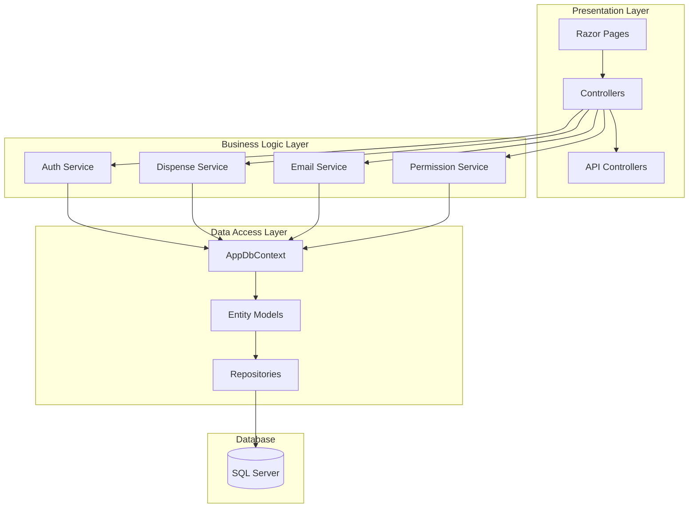
```mermaid
graph TB
    subgraph "Presentation Layer"
        A[Razor Pages]
        B[Controllers]
        C[API Controllers]
    end
    
    subgraph "Business Logic Layer"
        D[Auth Service]
        E[Dispense Service]
        F[Email Service]
        G[Permission Service]
    end
    
    subgraph "Data Access Layer"
        H[AppDbContext]
        I[Entity Models]
        J[Repositories]
    end
    
    subgraph "Database"
        K[(SQL Server)]
    end
    
    A --> B
    B --> C
    B --> D
    B --> E
    B --> F
    B --> G
    D --> H
    E --> H
    F --> H
    G --> H
    H --> I
    I --> J
    J --> K
```

### Database Entity Relationship

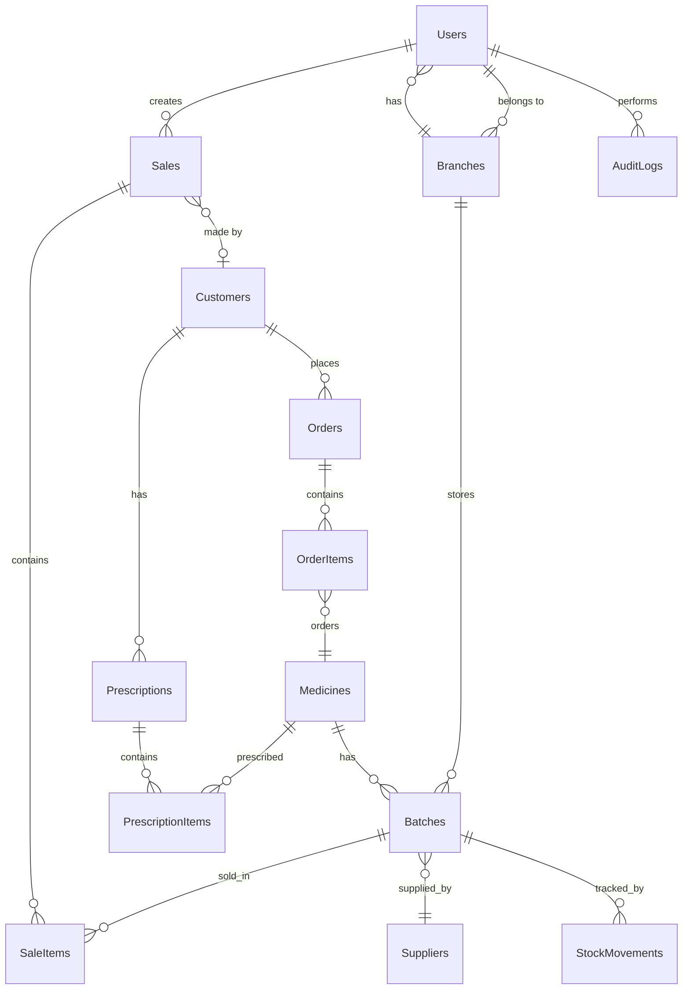
```mermaid
erDiagram
    Users ||--o{ Sales : creates
    Users ||--o{ Branches : "belongs to"
    Branches ||--o{ Users : has
    Branches ||--o{ Batches : stores
    
    Medicines ||--o{ Batches : has
    Medicines ||--o{ PrescriptionItems : prescribed
    
    Batches ||--o{ SaleItems : sold_in
    Batches }o--|| Suppliers : supplied_by
    Batches ||--o{ StockMovements : tracked_by
    
    Sales ||--o{ SaleItems : contains
    Sales }o--o| Customers : "made by"
    
    Customers ||--o{ Orders : places
    Customers ||--o{ Prescriptions : has
    
    Orders ||--o{ OrderItems : contains
    OrderItems }o--|| Medicines : orders
    
    Prescriptions ||--o{ PrescriptionItems : contains
    
    Users ||--o{ AuditLogs : performs
```

---

## Key Features Flow

### FEFO (First Expired, First Out) Logic

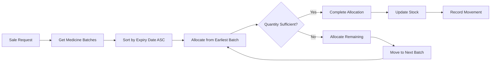
```mermaid
flowchart LR
    A[Sale Request] --> B[Get Medicine Batches]
    B --> C[Sort by Expiry Date ASC]
    C --> D[Allocate from Earliest Batch]
    D --> E{Quantity Sufficient?}
    E -->|Yes| F[Complete Allocation]
    E -->|No| G[Allocate Remaining]
    G --> H[Move to Next Batch]
    H --> D
    F --> I[Update Stock]
    I --> J[Record Movement]
```

### Role-Based Access Control

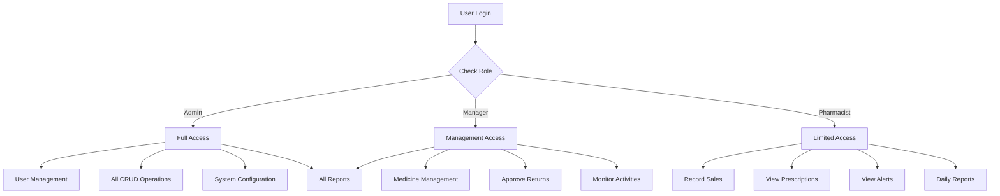
```mermaid
flowchart TD
    A[User Login] --> B{Check Role}
    B -->|Admin| C[Full Access]
    B -->|Manager| D[Management Access]
    B -->|Pharmacist| E[Limited Access]
    
    C --> F[User Management]
    C --> G[All CRUD Operations]
    C --> H[System Configuration]
    C --> I[All Reports]
    
    D --> J[Medicine Management]
    D --> K[Approve Returns]
    D --> I
    D --> L[Monitor Activities]
    
    E --> M[Record Sales]
    E --> N[View Prescriptions]
    E --> O[View Alerts]
    E --> P[Daily Reports]
```

---

## Complete System Flow

### End-to-End Customer Journey

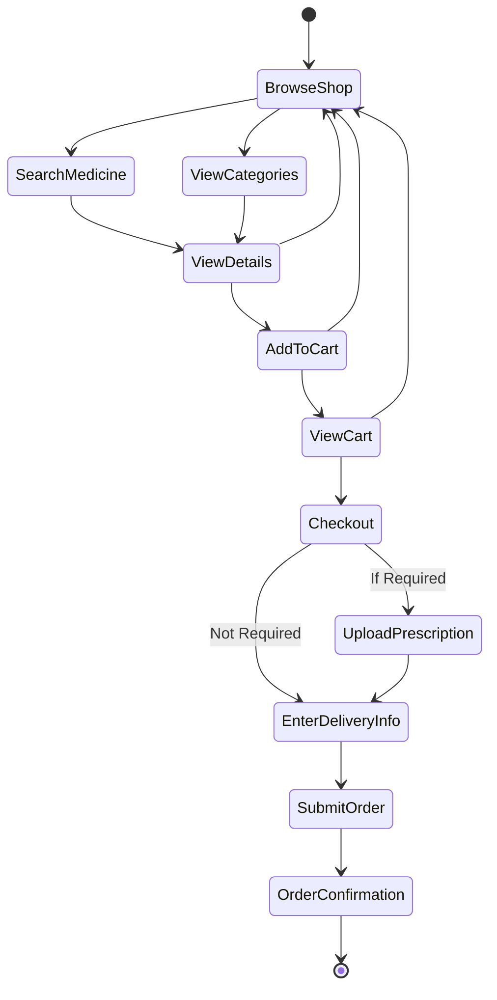
```mermaid
stateDiagram-v2
    [*] --> BrowseShop
    BrowseShop --> SearchMedicine
    BrowseShop --> ViewCategories
    SearchMedicine --> ViewDetails
    ViewCategories --> ViewDetails
    ViewDetails --> AddToCart
    ViewDetails --> BrowseShop
    AddToCart --> ViewCart
    AddToCart --> BrowseShop
    ViewCart --> Checkout
    ViewCart --> BrowseShop
    Checkout --> UploadPrescription: If Required
    Checkout --> EnterDeliveryInfo: Not Required
    UploadPrescription --> EnterDeliveryInfo
    EnterDeliveryInfo --> SubmitOrder
    SubmitOrder --> OrderConfirmation
    OrderConfirmation --> [*]
```

### Staff Workflow State Machine

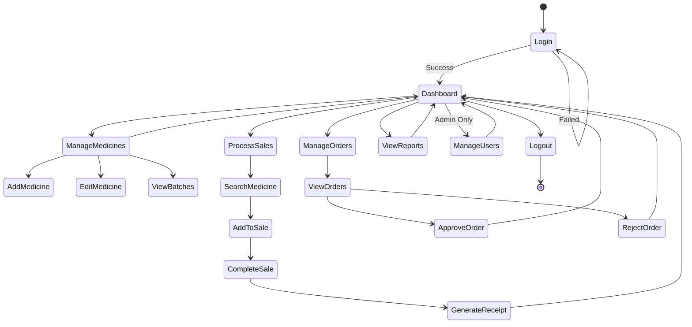
```mermaid
stateDiagram-v2
    [*] --> Login
    Login --> Dashboard: Success
    Login --> Login: Failed
    Dashboard --> ManageMedicines
    Dashboard --> ProcessSales
    Dashboard --> ManageOrders
    Dashboard --> ViewReports
    Dashboard --> ManageUsers: Admin Only
    
    ManageMedicines --> AddMedicine
    ManageMedicines --> EditMedicine
    ManageMedicines --> ViewBatches
    ManageMedicines --> Dashboard
    
    ProcessSales --> SearchMedicine
    SearchMedicine --> AddToSale
    AddToSale --> CompleteSale
    CompleteSale --> GenerateReceipt
    GenerateReceipt --> Dashboard
    
    ManageOrders --> ViewOrders
    ViewOrders --> ApproveOrder
    ViewOrders --> RejectOrder
    ApproveOrder --> Dashboard
    RejectOrder --> Dashboard
    
    ViewReports --> Dashboard
    ManageUsers --> Dashboard
    
    Dashboard --> Logout
    Logout --> [*]
```

---

## Detailed Sequence Diagrams

### 6. Inventory Stock Alert System

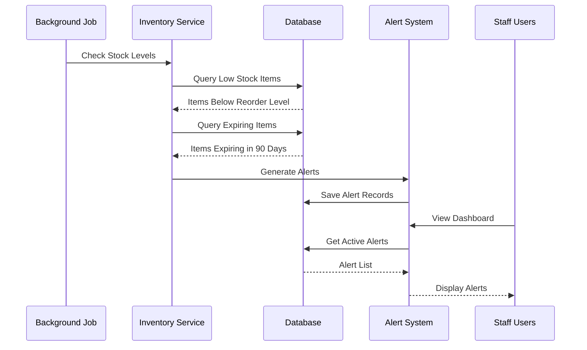
```mermaid
sequenceDiagram
    participant Scheduler as Background Job
    participant Inventory as Inventory Service
    participant DB as Database
    participant Alert as Alert System
    participant Staff as Staff Users
    
    Scheduler->>Inventory: Check Stock Levels
    Inventory->>DB: Query Low Stock Items
    DB-->>Inventory: Items Below Reorder Level
    
    Inventory->>DB: Query Expiring Items
    DB-->>Inventory: Items Expiring in 90 Days
    
    Inventory->>Alert: Generate Alerts
    Alert->>DB: Save Alert Records
    
    Staff->>Alert: View Dashboard
    Alert->>DB: Get Active Alerts
    DB-->>Alert: Alert List
    Alert-->>Staff: Display Alerts
```

### 7. Report Generation

```mermaid
sequenceDiagram
    actor Manager
    participant Report as Report Controller
    participant Service as Report Service
    participant DB as Database
    participant Export as Export Service
    
    Manager->>Report: Request Sales Report
    Report-->>Manager: Report Parameters Form
    
    Manager->>Report: Submit Parameters
    Report->>Service: Generate Report
    
    Service->>DB: Query Sales Data
    DB-->>Service: Sales Records
    
    Service->>DB: Query Medicine Data
    DB-->>Service: Medicine Info
    
    Service->>Service: Calculate Statistics
    Service->>Service: Format Report
    
    Service-->>Report: Report Data
    Report-->>Manager: Display Report
    
    Manager->>Report: Export Report
    Report->>Export: Generate PDF/Excel
    Export-->>Manager: Download File
```

### 8. Branch-Specific Operations

```mermaid
sequenceDiagram
    actor User
    participant Auth as Auth Service
    participant Controller as Controller
    participant Service as Business Service
    participant DB as Database
    
    User->>Auth: Login
    Auth->>DB: Get User + Branch
    DB-->>Auth: User Data (BranchId)
    Auth-->>User: Authenticated (BranchId in Session)
    
    User->>Controller: Request Data
    Controller->>Auth: Get Current User Branch
    Auth-->>Controller: BranchId
    
    Controller->>Service: Query with BranchId Filter
    Service->>DB: SELECT WHERE BranchId = ?
    DB-->>Service: Branch-Specific Data
    Service-->>Controller: Filtered Results
    Controller-->>User: Display Branch Data Only
```

---

## System Architecture Diagrams

### Layered Architecture

```mermaid
graph TB
    subgraph "Client Layer"
        A1[Web Browser]
        A2[Mobile Browser]
    end
    
    subgraph "Presentation Layer"
        B1[Razor Pages/Views]
        B2[MVC Controllers]
        B3[API Controllers]
    end
    
    subgraph "Business Logic Layer"
        C1[AuthService]
        C2[DispenseService]
        C3[EmailService]
        C4[PermissionService]
    end
    
    subgraph "Data Access Layer"
        D1[AppDbContext]
        D2[Entity Framework Core]
        D3[Entity Models]
    end
    
    subgraph "Database Layer"
        E1[(SQL Server)]
    end
    
    A1 --> B1
    A2 --> B1
    B1 --> B2
    B2 --> B3
    B2 --> C1
    B2 --> C2
    B2 --> C3
    B2 --> C4
    C1 --> D1
    C2 --> D1
    C3 --> D1
    C4 --> D1
    D1 --> D2
    D2 --> D3
    D3 --> E1
```

### Request Processing Pipeline

```mermaid
flowchart LR
    A[HTTP Request] --> B[Middleware Pipeline]
    B --> C[Authentication]
    C --> D[Authorization]
    D --> E[Controller Action]
    E --> F[Service Layer]
    F --> G[Data Access]
    G --> H[Database]
    H --> I[Response]
    I --> J[View Rendering]
    J --> K[HTTP Response]
```

---

## Business Process Diagrams

### Inventory Management Process

```mermaid
flowchart TD
    A[Receive Medicine] --> B[Create Medicine Record]
    B --> C[Add Batch Details]
    C --> D[Set Expiry Date]
    D --> E[Set Purchase Price]
    E --> F[Set Selling Price]
    F --> G[Link Supplier]
    G --> H[Record Stock Movement IN]
    H --> I[Update Inventory]
    I --> J{Below Reorder Level?}
    J -->|Yes| K[Generate Alert]
    J -->|No| L[Complete]
    K --> L
```

### Customer Order Lifecycle

```mermaid
stateDiagram-v2
    [*] --> Pending: Order Submitted
    Pending --> UnderReview: Staff Views
    UnderReview --> Approved: Stock Available & Valid
    UnderReview --> Rejected: Stock Unavailable or Invalid
    Approved --> Processing: Preparing Order
    Processing --> ReadyForDelivery: Order Packed
    ReadyForDelivery --> Delivered: Customer Receives
    ReadyForDelivery --> Cancelled: Customer Cancels
    Rejected --> [*]
    Delivered --> [*]
    Cancelled --> [*]
```

---

## Integration Diagrams

### API Integration Flow

```mermaid
flowchart TD
    A[External Client] -->|HTTP Request| B[API Controller]
    B --> C{Authenticate}
    C -->|Invalid| D[401 Unauthorized]
    C -->|Valid| E{Authorize}
    E -->|Forbidden| F[403 Forbidden]
    E -->|Allowed| G[Process Request]
    G --> H[Business Logic]
    H --> I[Database Query]
    I --> J[Format Response]
    J --> K[Return JSON]
    K --> A
    D --> A
    F --> A
```

### Medicine Search API Flow

```mermaid
sequenceDiagram
    participant Client
    participant API as Medicines API
    participant Cache as Cache Layer
    participant DB as Database
    
    Client->>API: GET /api/medicines?q=search
    API->>Cache: Check Cache
    
    alt Cache Hit
        Cache-->>API: Cached Results
    else Cache Miss
        API->>DB: Query Medicines
        DB-->>API: Medicine List
        API->>Cache: Store Results
    end
    
    API->>API: Filter by Branch
    API->>API: Include Stock Info
    API->>API: Format JSON
    API-->>Client: Return Results
```

---

## Security Flow

### Permission-Based Access Control

```mermaid
flowchart TD
    A[User Request] --> B[Check Authentication]
    B -->|Not Authenticated| C[Redirect to Login]
    B -->|Authenticated| D[Get User Permissions]
    D --> E[Check Required Permission]
    E -->|Has Permission| F[Execute Action]
    E -->|No Permission| G[403 Forbidden]
    F --> H[Audit Log]
    H --> I[Return Response]
```

### Audit Trail Flow

```mermaid
sequenceDiagram
    actor User
    participant Controller
    participant Service
    participant Audit as Audit Service
    participant DB as Database
    
    User->>Controller: Perform Action
    Controller->>Service: Execute Business Logic
    Service->>DB: Modify Data
    DB-->>Service: Success
    
    Service->>Audit: Log Action
    Audit->>DB: Insert Audit Log
    Note over Audit,DB: UserId, Action, Entity, EntityId, Detail, Timestamp
    
    DB-->>Audit: Log Saved
    Audit-->>Service: Logged
    Service-->>Controller: Action Complete
    Controller-->>User: Success Response
```

---

## Notes

This comprehensive documentation covers all major flows and interactions in the DuPharma Pharmacy Management System. The diagrams can be viewed in:

- GitHub/GitLab (native Mermaid support)
- VS Code (with Mermaid extension)
- Any Markdown viewer with Mermaid support
- Online Mermaid editors (mermaid.live)

Each diagram represents a critical aspect of the system for documentation, training, and development purposes.
